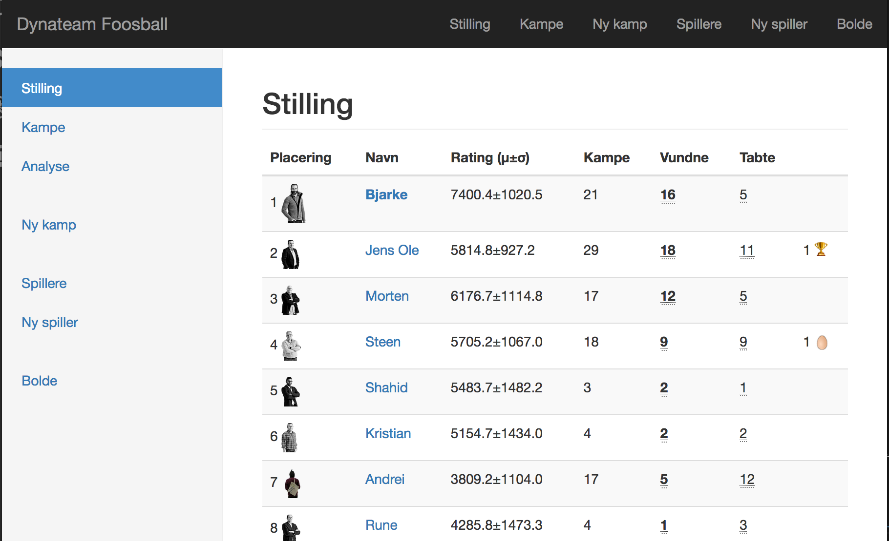

# foosball
A ratings calculator for the office foosball league

Maintains a leader board using a ratings system, BBT;
based on Glicko, SkillScore and Elo.

The more games you play the less variance on your rating.
Compete against better rated player (and win) to improve
your rating the most.

This is more fair when some don't have as much time to play as
as others. Also those who have a good streak cannot rest on
their laurels for long.

We are currently testing the software in-house with a lot
of games. Figuring out what makes sense and what doesn't.

Ease of use and a nice layout ensures that all games get tracked.

## todo
See [open issues: label: bugs](https://github.com/gugi9000/foosball/issues?q=is%3Aissue+is%3Aopen+label%3Abug)

## ideas
See [open issues: label: todo](https://github.com/gugi9000/foosball/issues?q=is%3Aissue+is%3Aopen+label%3Atodo)

